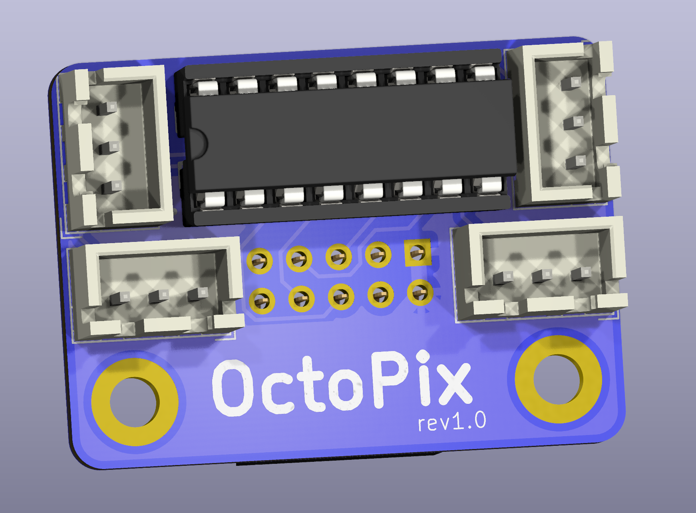
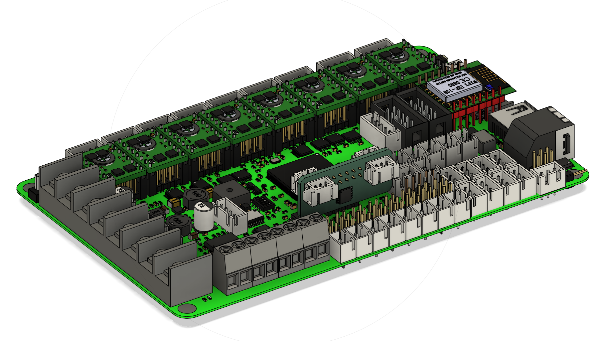
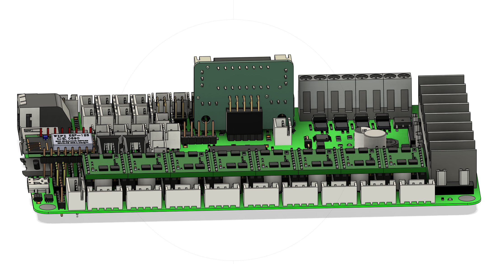

# OctoPix Expansion PCB for BTT Octopus and Octopus Pro Boards

This PCB expansion board adds additional Neopixel outputs to your BTT Octopus or Octopus Pro board, enabling customizable RGB lighting configurations. It connects via the SPI3 header (J47) and offers four JST-PH 3-pin SMD connectors for multiple Neopixel connections.

## Features

- **4x JST-PH 3-pin SMD connectors** for Neopixel data connections
- Compatible with both **BTT Octopus** and **BTT Octopus Pro** control boards for 3D printers
- Directly connects to the **SPI3 (J47)** header on the Octopus board
- Compact design fits neatly without obstructing other components on the Octopus or Octopus Pro boards
- **Buffered data signals** using a **TXS0104EPWR** for robust Neopixel communication

## Bill of Materials (BOM)

| Quantity | Part Description                                         | Example Sourcing Links                                                                                                          |
|----------|----------------------------------------------------------|-----------------------------------------------------------------------------------------------------------------------|
| 4        | JST-PH 3-pin SMD connectors                              | [DigiKey JST-PH 3-pin](https://www.digikey.com/en/products/detail/jst-sales-america-inc/S3B-PH-SM4-TB/926656)                           |
| 1        | 2x5 through hole header, 2.54mm pitch                             | [DigiKey SFH11-PBPC-D05-SMD](https://www.digikey.com/en/products/detail/sullins-connector-solutions/SFH11-PBPC-D05-SMD/1990096) |
| 1        | TXS0104EPWR SMD package                                  | [DigiKey TXS0104EPWR](https://www.digikey.com/en/products/detail/texas-instruments/TXS0104EPWR/1143662)                     |

## Installation

1. Align the OctoPix PCB with the **J47 SPI3 header** on the Octopus or Octopus Pro board.
2. Carefully press the OctoPix PCB into the J47 header until fully seated.
3. Connect your Neopixel strips to the 3-pin JST-PH connectors on the OctoPix PCB.
4. Power on your Octopus or Octopus Pro board and configure Neopixel effects using your preferred firmware (e.g., Klipper, Marlin).

**OctoPix PCB Installed on BTT Octopus Board** (front and rear views):

## Credits

This project was created by **knight_rad.iant** on Discord. Join the discussion and follow updates on the design.

---

Contributions, suggestions, and improvements are welcome. Please open an issue or submit a pull request if you have ideas to enhance this project.