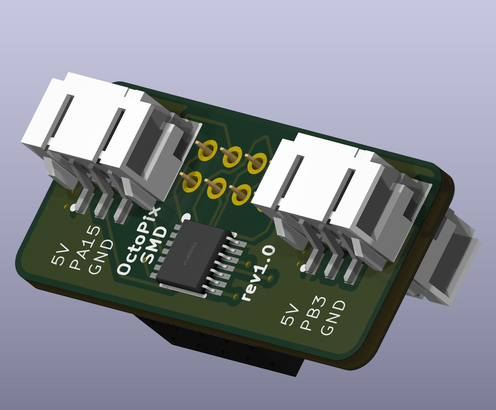
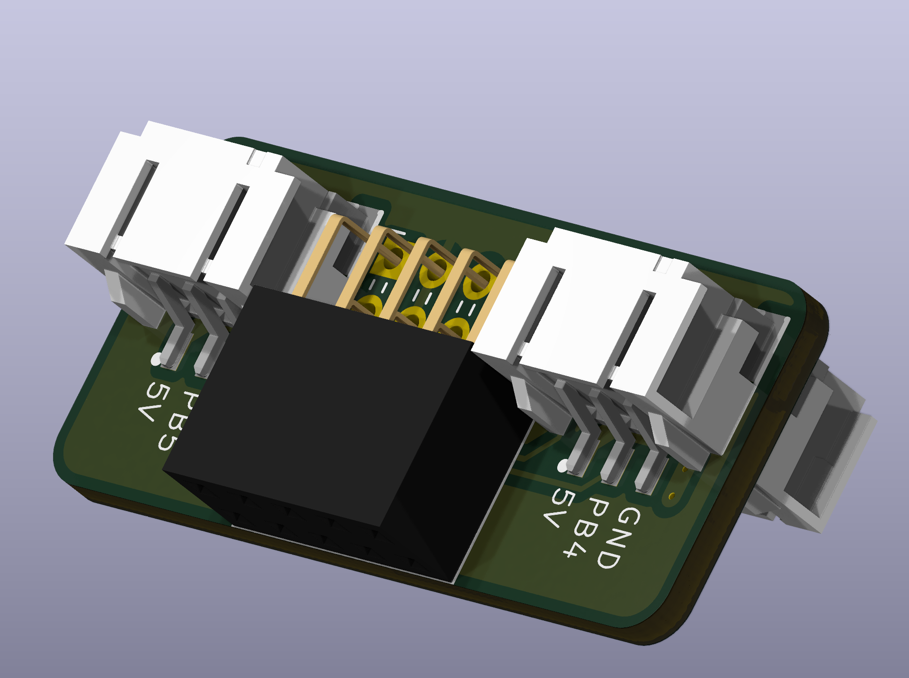
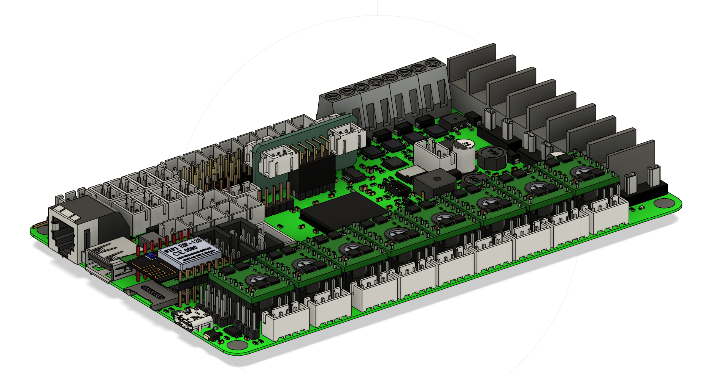

# OctoPix Expansion PCB for BTT Octopus Board




This PCB expansion board adds additional Neopixel outputs to your BTT Octopus board, allowing for custom RGB lighting configurations. It plugs into the Octopus's SPI3 header (J47) and provides four JST-XH 3-pin connectors to support up to four separate Neopixel connections.

## Features

- **4x JST-XH 3-pin connectors** for Neopixel data connections
- Compatible with the **BTT Octopus** control board for 3D printers
- Designed to plug directly into the **SPI3 (J47)** header on the Octopus
- Compact design fits neatly without obstructing other ports or components on the Octopus board
- **Buffered data signals** using a **CD4050B** (DIP 16 package) for reliable Neopixel communication

## Bill of Materials (BOM)

| Quantity | Part Description                                      | Example Sourcing Links                                                                                                          |
|----------|-------------------------------------------------------|-----------------------------------------------------------------------------------------------------------------------|
| 4        | JST-XH 3-pin connectors                               |   [DigiKey](https://www.digikey.com/en/products/detail/jst-sales-america-inc/B3B-XH-A/1651046)                                                                                                                    |
| 1        | 2x5 header, 2.54mm pitch (Sullins SFH11-PBPC-D05-RA-BK) | [DigiKey SFH11-PBPC-D05-RA-BK](https://www.digikey.com/en/products/detail/sullins-connector-solutions/SFH11-PBPC-D05-RA-BK/1990095) |
| 1        | CD4050B (DIP 16 package)                              |   [DigiKey](https://www.digikey.com/en/products/detail/texas-instruments/CD4050BE/67303)                                                                                                                    |

## Installation

1. Align the OctoPix PCB with the **J47 SPI3 header** on the Octopus board.
2. Gently press the OctoPix PCB into the J47 header until fully seated.
3. Connect your Neopixel strips to the 3-pin JST-XH connectors on the OctoPix PCB.
4. Power on your Octopus board and configure your Neopixel effects using your preferred firmware (e.g., Klipper, Marlin).

**OctoPix PCB Installed on BTT Octopus Board** (front and rear views):



## Known Issues & Solutions

Some users have reported the isssue that when assigning PB3, PB4, and PB5 to neopixels, klipper reports the pins as already being assigned to ``spi3`` (specially in STM32F446 MCUs).
If you get this problem when restarting klipper, the solution is to recompile klipper firmware commenting out the lines below, found in the source code under ``~/klipper/src/stm32/spi.c``:

```
 DECL_ENUMERATION("spi_bus", "spi3", 4);
 DECL_CONSTANT_STR("BUS_PINS_spi3", "PB4,PB5,PB3");
```

The lines should instead read:

```
//DECL_ENUMERATION("spi_bus", "spi3", 4);
//DECL_CONSTANT_STR("BUS_PINS_spi3", "PB4,PB5,PB3");
```

After re-compiling and flashing the Octopus, PB3, PB4, and PB5 should be free to be used as GPIO pins instead of being bound to ``spi3``

## Credits

This project was created by **knight_rad.iant** on Discord. Join the discussion and follow updates on the design.

---

Contributions, suggestions, and improvements are welcome. Please open an issue or submit a pull request if you have ideas to enhance this project.
